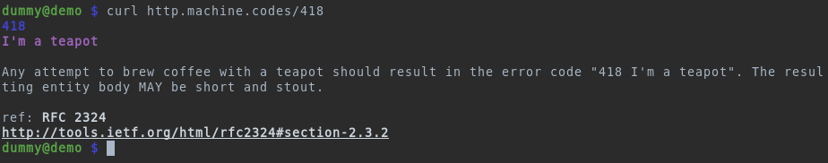

# http.machine.codes

A quick HTTP reference. Available at [http.machine.codes]

## How it is meant to be used

From the terminal!

```bash
curl http.machine.codes/status/200
```



## Available formats

* `/<status-code>` for terminal with ANSI
* `/<status-code>.txt` plain text
* `/<status-code>.htm` HTML version

## Building

### Prerequisites

* php cli
* [s3_website]


### Building

```bash
make
```

### Deploying

Note: This won't work for you ;-)

Probably replaced with CI in the future.

```bash
make deploy
```

[http.machine.codes]: https://http.machine.codes
[s3_website]: https://github.com/laurilehmijoki/s3_website
